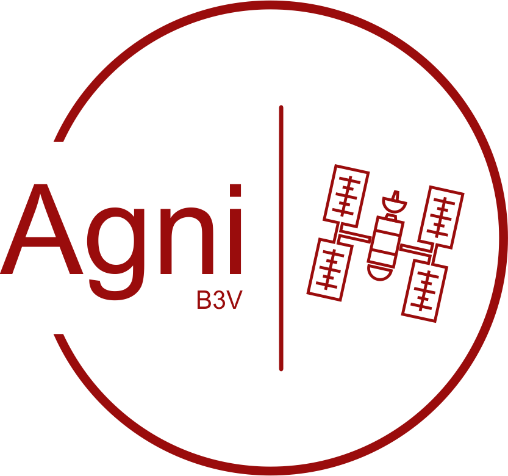

<p align="center">
    
</p>
<p align="center">
    <font color="#9A0C0C" size=5><i>Parallelized Satellite Thermal Analysis System</i></font>
</p>
 

**This is the code repository of AGNI B3V. For install instructions, user/technical manuals and benchmarks  visit the website: https://agnib3v.github.io/**


# Introduction

Agni B3V is an all encompassing solution for modeling, simulating and interpreting thermal phenomena affecting satellites in circular orbits and sun pointing aptitudes. It currently includes tools capable of:

* Building satellite structure meshes through primitives union or individual node placement and connection.
* Automatically remeshing models to improve FEM results.
* Assigning different materials and conditions to separate parts of the model.
* Configuring desired orbit and constants such as earth ir emission, albedo and sun intensity.
* Estimating view factors and energy exchange between elements and between elements and other celestial bodies.
* Simulating second by second temperature modification in an specified interval of time and orbit.
* Postprocessing results and extracting relevant data and graphs.


# Authors

This system was developed in the context of the professional task for "Universidad de Buenos Aires" by:

Barreneche Franco  (fbarreneche@fi.uba.ar)
Belinche Gianluca (gbelinche@fi.uba.ar) 
Botta Guido (gbotta@fi.uba.ar)
Ventura Julian (jventura@fi.uba.ar)


# Building from source

A convenient installer is provided in https://agnib3v.github.io/. Alternatively, each tool can be build (if necessary) and used independently.


## Preprocessor, Plotter, User GUI

Install Python 3 by your preferred method. Eg:

```
sudo apt install python3
```

Install the required Python libraries through pip:

```
pip install -r requirements.txt
```


## Solver

Install Rust through rustup as recommended in https://www.rust-lang.org/tools/install

```
curl --proto '=https' --tlsv1.2 -sSf https://sh.rustup.rs | sh
```

Move to solver folder

```
cd solver
```

Build with cargo

```
cargo build --release
mv target/release/solver solver
```


## FreeCAD  + Agni Addon

Move to freecad folder

```
cd freecad
```

Install FreeCAD

```
sh freecad-install.sh
```

Install Agni Addon

```
sh workbench-install.sh
```


## GMAT


## Paraview

